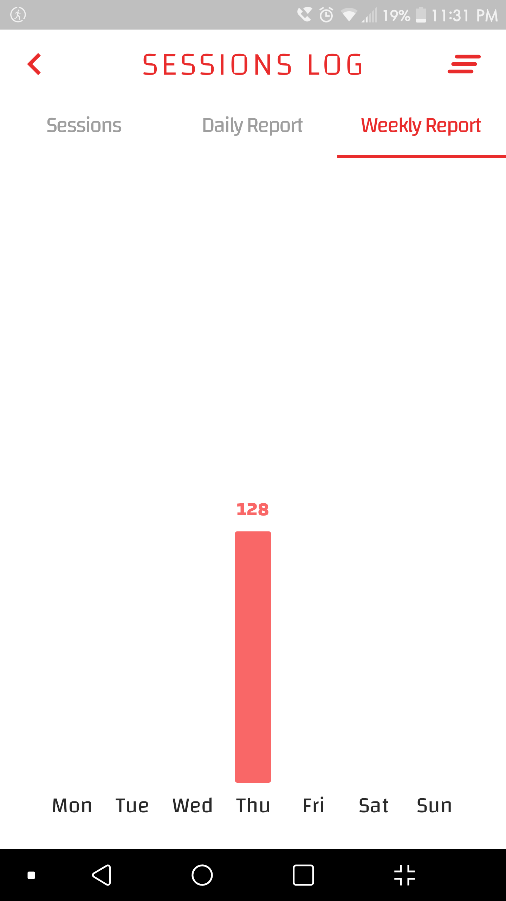

## This is a **Heartbeats Monitor** App made with Flutter

- Monitoring heartbeats
- Saving each session locally in the device.
- Setting a normal bpm range according to age.
- Calling emergency when session’s bpm is out of normal range.
- Plotting a graph for the sensor data.
- Customizing the app with themes and color schemes
- There is a daily and weekly report for your      sessions to monitor your progression

 

## Libraries and Packages used:
1- <a href="https://pub.dev/packages/camera">camera: 0.10.0+4</a>

2- <a href="https://pub.dev/packages/charts_flutter_new">charts_flutter_new: 0.12.0</a>

3- <a href="https://pub.dev/packages/fl_chart">fl_chart: 0.61.0</a>

4- <a href="https://pub.dev/packages/get">get: 4.6.5</a>

5- <a href="https://pub.dev/packages/path">path: 1.8.2</a>

6- <a href="https://pub.dev/packages/shared_preferences">shared_preferences: 2.0.15</a>

7- <a href="https://pub.dev/packages/sqflite">sqflite: 2.2.0+3</a>

8- <a href="https://pub.dev/packages/url_launcher">url_launcher: 6.1.7</a>

9- <a href="https://pub.dev/packages/wakelock">wakelock: 0.6.2</a>

10- <a href="https://pub.dev/packages/flutter_native_splash">flutter_native_splash: 2.2.16</a>

 

## App Screenshots

| Main Page | Monitor | Settings |
| :-: | :-: | :-: |
 |  |  |

| Sessions | Daily Report | Weekly Report |
| :-: | :-: | :-: |
 |  | 

 

---
`Finished on 12-May-23`